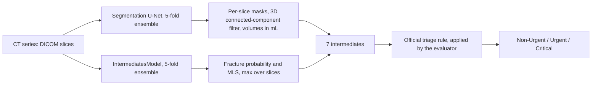

# IAAA Brain CT Triage Challenge

A deep-learning pipeline that predicts triage urgency (Non-Urgent / Urgent /
Critical) from non-contrast head CT scans. Instead of training an end-to-end
classifier, it estimates seven clinically meaningful intermediates — five
hemorrhage-subtype volumes, skull-fracture probability, and midline shift —
and lets the competition's fixed, rule-based triage function make the final
decision.

**Official score: `f1_macro = 0.8551`** (up from `0.3427` for the first
multiple-instance-learning baseline). The story behind that number is in
[Engineering Journey & Key Findings](#engineering-journey--key-findings).

## Table of Contents
- [Problem](#problem)
- [Approach](#approach)
- [Results](#results)
- [Engineering Journey & Key Findings](#engineering-journey--key-findings)
- [Limitations & Next Steps](#limitations--next-steps)
- [Repository Structure](#repository-structure)
- [Quick Start](#quick-start)
- [Tech Stack](#tech-stack)
- [License](#license)

## Problem

Given a non-contrast head CT series (a stack of 2D DICOM slices), predict one
of three triage classes:

| Class | Meaning |
|---|---|
| 0 | Non-Urgent |
| 1 | Urgent |
| 2 | Critical |

Submissions are scored by **`f1_macro`** on a hidden test set. The final
triage decision is **not learned**: it is a fixed rule
(`triage_from_intermediates`, ported verbatim from the official docs)
applied to seven predicted intermediates:

- Five hemorrhage-subtype volumes in mL: epidural (EDH), subdural (SDH),
  intraparenchymal (IPH), subarachnoid (SAH), intraventricular (IVH)
- Skull-fracture probability
- Midline shift (MLS) in mm

So the whole system exists to estimate these seven imaging biomarkers as
accurately as possible. The submitted CSV contains exactly these intermediates
(`series_id` + 7 columns); the evaluator applies the triage rule.

## Approach



**Pipeline evolution**

1. **MIL baseline** — an attention-based Multiple Instance Learning classifier
   trained directly on triage labels. Ceiling: `f1_macro = 0.34`. A diagnostic
   comparing internal cross-validation against the hidden-test score showed
   this was a real architecture ceiling, not overfitting (notebook Section 12).
2. **Hybrid, intermediates-first pipeline** (the approach that shipped):
   - **Segmentation model** — U-Net with a ResNet18 encoder, 5-fold ensemble,
     predicting a 6-class pixel mask per slice (background + 5 hemorrhage
     types). Volumes come from pixel counts × physical voxel spacing.
   - **IntermediatesModel** — ResNet18 plus a physical-embedding MLP, 5-fold
     ensemble, predicting fracture probability and midline shift per slice.
   - **Official triage rule** — deterministic, applied to the aggregated
     predictions.

Both model families run inside one self-contained `submission/submission.py`
(no imports from `src/`), verified end-to-end before every official submission
(notebook Sections 11 and 23).

## Results

| Version | f1_macro | Notes |
|---|---|---|
| MIL baseline (v1) | 0.343 | Direct end-to-end classifier; architecture ceiling |
| Hybrid pipeline (v1) | 0.830 | Segmentation + IntermediatesModel + triage rule |
| **Hybrid pipeline + fracture fix** | **0.855** | Noisy-OR → max-pooling aggregation (see below) |

## Engineering Journey & Key Findings

The real value of this project is the validation discipline behind the
numbers. Highlights (details in `notebooks/`, with section references):

- **A confounded experiment, caught before it mattered.** A weighted-loss fix
  for midline-shift regression looked like a clear win until a paired
  significance test showed the comparison had silently changed *two* things
  at once: the loss weighting **and** the checkpoint-selection criterion. A
  deconfounded re-test (retrospective checkpoint re-selection on the existing
  logs) showed no real effect (MAE p = 0.22, AUC p = 0.75). *(Section 21.7)*
- **A canary test to rule out evaluator-side caching.** Two resubmissions had
  produced identical scores despite believed code changes. Rather than assume
  a caching bug, a cheap diagnostic submission (all-zero predictions, with a
  fully predictable score) confirmed the evaluator does re-execute code. A
  byte-verified resubmission then showed the connected-component noise filter
  is a genuine no-op on the hidden set. *(Section 25.5)*
- **A physics-based hypothesis, tested and rejected.** Suspected false-positive
  hemorrhage detections were hypothesized to be calcification, which would be
  separable by Hounsfield Unit. Measuring native-resolution HU showed every
  candidate sat in the blood range (median 45–61 HU), not the calcification
  range. The hypothesis was rejected by data and documented as a negative
  result. *(Section 26)*
- **The highest-leverage fix was a math bug in aggregation, not the model.**
  Two false-Urgent series traced to `aggregate_fracture` using noisy-OR
  (`1 − ∏(1 − pᵢ)`) across slices, which compounds many individually
  uncertain per-slice predictions into a falsely confident aggregate (for
  example, ~13 slices at ≈0.2 each gave 0.96). Switching to max-pooling,
  matching what midline shift already used, dropped the two known false
  positives to ≈0.25 while six genuine fracture series stayed at 0.70–0.87,
  and moved the official score from 0.830 to 0.855. *(Section 27)*

The through-line: every fix that shipped had been **measured** against real
data first, and hypotheses that did not survive that test were documented and
abandoned instead of force-fit.

## Limitations & Next Steps

- **Remaining error pattern.** A local audit of the deployed pipeline (note:
  the same series were seen in training, so it is optimistic) shows the
  dominant remaining error is true Non-Urgent predicted as Urgent, mostly from
  small-to-moderate false-positive hemorrhage volumes. Many of those series
  have only partial pixel-annotation coverage (the training metadata contains
  only annotated slices; coverage per affected series ranges from about 19% to
  100%), so the segmentation model is partly blind there.
- **Idea explored, not finished.** A weakly-supervised "absence constraint"
  (use series-level `V_IPH = 0` labels to push the IPH channel toward zero on
  unannotated slices) was designed and its loss unit-tested; integrating it
  into segmentation training was not completed.
- **Midline-shift regression** still shows bidirectional errors; label/feature
  distribution smoothing (Yang et al., *Delving into Deep Imbalanced
  Regression*, ICML 2021) is the natural next approach if revisited.
- **Code hygiene.** DICOM load → HU → window → resize logic is duplicated in
  a few places and should be consolidated into `src/preprocessing.py`.

## Repository Structure

```
.
├── README.md
├── LICENSE
├── requirements.txt
├── .gitattributes              # Git LFS rules for *.pt weights
├── notebooks/
│   └── IAAA_Brain_CT_Triage_MASTER.ipynb   # full pipeline, numbered sections
├── src/                        # reusable modules used by the notebook
│   ├── preprocessing.py        # DICOM loading, HU conversion, multi-window images
│   ├── augmentation.py         # series-consistent augmentation
│   ├── dataset.py              # BrainCTSeriesDataset (MIL / intermediates)
│   ├── seg_dataset.py          # SegmentationSliceDataset
│   └── ...                     # model definitions and utilities
└── submission/
    ├── submission.py           # self-contained, competition-ready inference
    └── models/                 # trained weights, tracked with Git LFS (~580 MB)
        ├── seg_fold_*_best.pt          # segmentation U-Net, 5 folds
        └── ...                         # IntermediatesModel, 5 folds
```

The competition data (patient CT imaging) is **not** included and is excluded
by `.gitignore`.

## Quick Start

**Code only (no weights, uses no Git LFS bandwidth)**

```bash
GIT_LFS_SKIP_SMUDGE=1 git clone https://github.com/osint2030/iaaa-3rd-brain-ct-triage.git
cd iaaa-3rd-brain-ct-triage
pip install -r requirements.txt
```

With this clone the `.pt` files are small pointer files, so inference will not
run yet. Use it to read the code and the notebook.

**With weights (to run inference)**

```bash
sudo apt install git-lfs     # or: brew install git-lfs
git lfs install
git clone https://github.com/osint2030/iaaa-3rd-brain-ct-triage.git
cd iaaa-3rd-brain-ct-triage
pip install -r requirements.txt
```

If you already cloned with `GIT_LFS_SKIP_SMUDGE=1`, fetch the weights with
`git lfs pull`. The weights total roughly 580 MB.

**Run inference**

```bash
python submission/submission.py \
    --data-dir /path/to/series-folders \
    --predictions-file-path /path/to/output.csv
```

`--data-dir` must contain one subfolder per series with its `.dcm` files. The
output CSV has `series_id` plus the seven intermediates.

**Full walkthrough.** Open `notebooks/IAAA_Brain_CT_Triage_MASTER.ipynb`. It is
written for Google Colab and expects the competition data to be available from
Google Drive (see Section 1 and Section 2 for setup).

## Tech Stack

PyTorch · segmentation-models-pytorch (U-Net / ResNet18) · pydicom ·
scikit-learn · pandas / NumPy · OpenCV · SciPy (`ndimage` for 3D connected
components) · Google Colab (GPU training) · WSL2 / Ubuntu + Miniconda (local
development)

## License

MIT — see [LICENSE](LICENSE).
